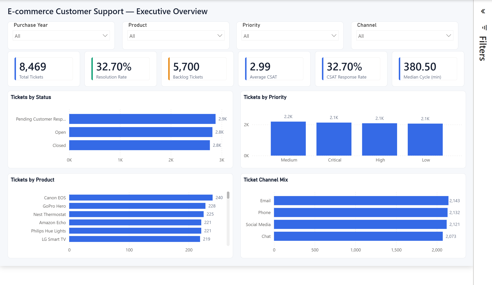
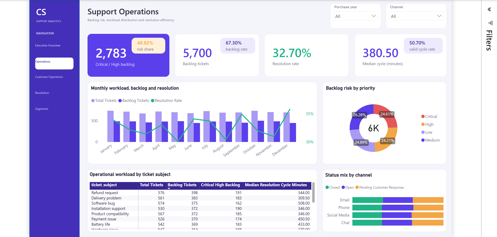
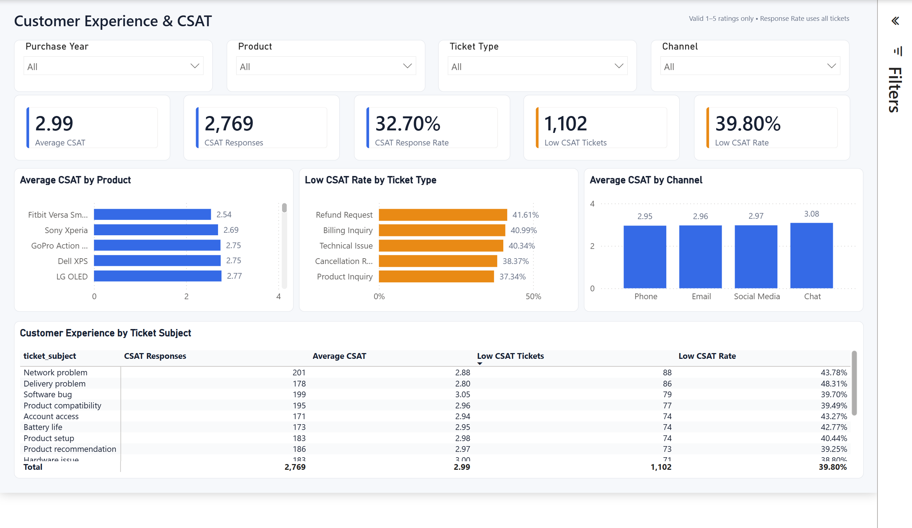
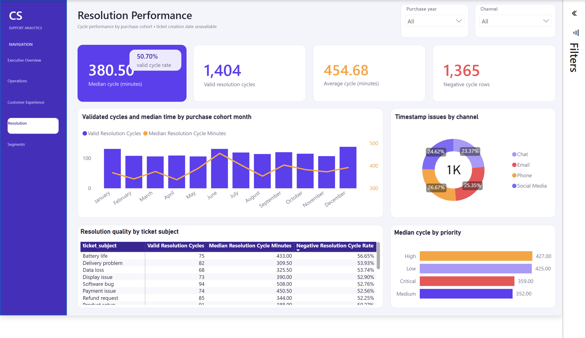
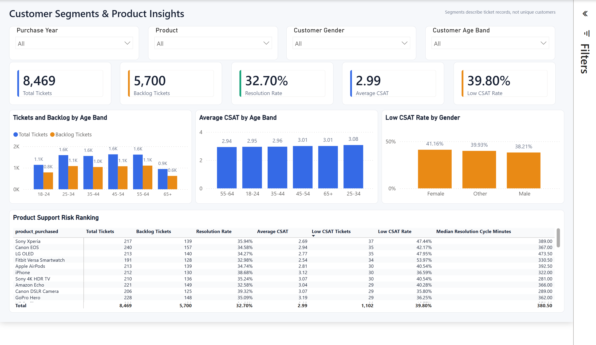

# E-commerce Customer Support Analytics

An end-to-end data analytics portfolio project that turns 8,469 raw customer-support tickets into a validated dimensional model, a SQL Server analytics layer, and a five-page Power BI report.



## Project at a glance

| Area | Implementation |
|---|---|
| Business goal | Understand support demand, backlog, customer satisfaction, resolution performance, and customer segments |
| Data | 8,469 tickets, 17 raw columns, one row per ticket |
| Data engineering | Python and pandas Bronze-to-Silver-to-Gold pipeline with explicit quality gates |
| Analytical model | One fact table, seven dimensions, seven relationships, and no customer PII |
| SQL | SQL Server staging and analytics schemas, typed loads, 34 validation checks, and eight analysis outputs |
| Power BI | Five report pages and 35 DAX measures with page navigation, alt text, and ordered keyboard focus |
| Testing | 21 automated Python tests plus versioned Silver and Gold quality summaries |

This project demonstrates data cleaning, data-quality engineering, dimensional modeling, SQL analysis, DAX, dashboard design, analytical communication, accessibility, and Git-based delivery.

## Business problem

The project assumes the role of a Data Analyst supporting the Customer Experience team of an online technology retailer. It addresses five questions:

- How large are the current support workload and backlog?
- Which channels, priorities, issue types, and products generate the most demand?
- Where are low customer-satisfaction scores concentrated?
- How quickly are tickets resolved when a valid resolution cycle is available?
- Which customer and purchase cohorts merit further investigation?

The data is public and synthetic/general-purpose; the project does not claim that it belongs to a real retailer.

## Solution architecture

```text
Kaggle CSV
   -> Bronze: immutable local source
   -> Python cleaning and validation
   -> Silver: analysis-ready ticket data
   -> Gold: fact_ticket + 7 dimensions
   -> SQL Server: staging + typed analytics model
   -> Power BI: semantic model + 35 DAX measures + 5 report pages
```

Generated CSV files stay local because of their size and potential customer PII. Versioned JSON quality summaries provide reproducible evidence of the pipeline results. The public Gold and Power BI models use a deterministic pseudonymous customer key and exclude customer names and email addresses.

## Key findings

- The model contains **8,469 tickets**: 2,769 closed and 5,700 in backlog, for a **32.70% resolution rate**.
- CSAT coverage is **32.70%**. Among tickets with a response, average CSAT is **2.99**, and **39.80%** have a low score of 1 or 2.
- Only 1,404 tickets have a valid resolution-cycle metric. Their average cycle is **454.68 minutes**, and their median is **380.50 minutes**.
- Email has the highest observed ticket volume (2,143). Chat has the highest average CSAT (3.08) and the lowest observed low-CSAT rate (36.35%) among channels.
- Refund Request / Hardware issue is the largest issue combination with 129 tickets. Canon EOS has the highest observed product ticket volume with 240 tickets.
- The source contains 1,365 negative resolution cycles (**16.12%**). They remain visible through a quality flag and are excluded from duration measures.

These results are descriptive. For example, channel performance is not evidence that a channel caused higher CSAT, and product ticket volume is not a defect rate because sales volume is unavailable.

## Power BI report

The report is stored as a version-controllable Power BI Project (`.pbip`). It contains a shared page navigator, explanatory notes for ambiguous metrics, report-level visual alt text, and a deterministic tab order.

The report has also been deployed to Power BI Service in a private My Workspace. Because the university tenant disables anonymous `Publish to web`, the five verified screenshots below serve as the public portfolio preview, while the complete PBIP source remains available in this repository.

### 1. Executive Overview

Executive KPIs, backlog composition, ticket demand, customer satisfaction, and the most important data-quality warning.


### 2. Support Operations

Operational workload by channel, priority, status, issue type, and backlog segment.



### 3. Customer Experience & CSAT

CSAT response coverage, average score, low-score concentration, and comparisons across service segments.



### 4. Resolution Performance

Valid resolution-cycle coverage, average and median duration, negative-cycle disclosure, and comparative resolution performance.



### 5. Customer Segments

Customer profile and purchase-cohort comparisons with clear sample-size context and non-causal interpretation.



## Data engineering and quality

The Silver pipeline performs:

- schema and column-name normalization;
- exact-duplicate removal and conflicting `ticket_id` handling;
- whitespace and categorical-value standardization;
- age, CSAT, date, and timestamp validation;
- invalid and negative temporal-cycle flags;
- analytical flags such as `is_closed`, `has_csat`, and `is_low_csat`;
- customer age bands and deterministic pseudonymous customer keys;
- pre-export quality gates and JSON audit-summary generation.

The latest versioned quality evidence reports:

| Check | Result |
|---|---:|
| Raw / Silver rows | 8,469 / 8,469 |
| Raw / Silver columns | 17 / 29 |
| Exact duplicates removed | 0 |
| Duplicate ticket IDs | 0 |
| Invalid ages, CSAT, dates, or timestamps | 0 |
| Negative resolution cycles | 1,365 |
| Gold fact rows / unique ticket IDs | 8,469 / 8,469 |
| Missing Gold foreign keys | 0 |
| Dimensions | 7 |

Negative resolution cycles are not converted with `abs()` or silently corrected. `dq_negative_resolution_cycle` preserves the issue, while `resolution_cycle_minutes` remains blank for those records.

## Analytical model and SQL layer

The Gold model contains `fact_ticket` plus dimensions for date, product, issue, channel, priority, status, and customer profile. The SQL Server implementation separates raw text ingestion in `staging` from the typed star schema in `analytics`.

Run the SQL scripts in order:

```text
sql/01_create_database.sql
sql/02_create_staging_tables.sql
sql/03_create_analytics_tables.sql
sql/04_load_staging.sql
sql/05_load_analytics.sql
sql/06_validate_model.sql
sql/07_business_analysis.sql
```

Before running `sql/04_load_staging.sql`, replace its local `BULK INSERT` file paths with the absolute path to your generated `data/gold` directory. The validation suite contains 34 repeatable checks covering row reconciliation, uniqueness, relationships, business rules, schema constraints, text cleanliness, and privacy. The final script provides eight reusable result sets for executive KPIs, backlog, channel, issue, product, priority, purchase cohort, and data quality.

## Reproduce the project

### 1. Download the dataset

Download [Customer Support Ticket Dataset by Suraj](https://www.kaggle.com/datasets/suraj520/customer-support-ticket-dataset) and save the file as:

```text
data/raw/customer_support_tickets.csv
```

The dataset is published under CC0 (Public Domain). Raw and generated CSV files are intentionally excluded from Git.

### 2. Create the Python environment

```powershell
python -m venv .venv
.\.venv\Scripts\Activate.ps1
python -m pip install -r requirements.txt
```

### 3. Build Silver and Gold data

Run from the repository root:

```powershell
python -m src.clean
python -m src.build_model
```

The commands generate the cleaned ticket dataset, eight Gold model CSV files, and their quality summaries.

### 4. Run automated tests

```powershell
python -m unittest discover -s tests -v
```

The 21 tests cover helpers, cleaning rules, invalid values, negative resolution cycles, dimensional-model integrity, PII exclusion, and end-to-end file generation.

### 5. Load SQL Server

Open the scripts in SQL Server Management Studio, update the Gold CSV paths in `sql/04_load_staging.sql`, and run scripts `01` through `07` in sequence.

### 6. Open Power BI

Open `powerbi/customer_support_analytics.pbip` in Power BI Desktop. If the local data path differs, update the source path in Power Query and refresh the model.

## Repository structure

```text
.
|-- data/
|   |-- raw/                    # Local source CSV (not committed)
|   |-- processed/              # Silver output + versioned quality JSON
|   |-- gold/                   # Fact/dimension outputs + quality JSON
|   `-- exceptions/             # Conflicting records (not committed)
|-- notebooks/
|   `-- 02_gold_model_profiling.ipynb
|-- powerbi/
|   |-- customer_support_analytics.pbip
|   |-- customer_support_analytics.Report/
|   |-- customer_support_analytics.SemanticModel/
|   `-- img/                    # Verified screenshots for all five pages
|-- sql/                        # SQL Server DDL, loads, validation, analysis
|-- src/                        # Silver/Gold pipelines and validation logic
|-- tests/
|   |-- test_cleaning.py
|   `-- test_model.py
|-- requirements.txt
`-- README.md
```

## Analytical limitations

- The source has no explicit `ticket_created_at` field.
- `Date of Purchase` must not be interpreted as ticket creation date.
- The two operational time fields contain timestamps, despite source labels that suggest durations.
- `resolution_cycle_minutes` measures first response to resolution; it is not first-response time.
- The dataset has no agent, SLA target, sales denominator, order revenue, or support-cost fields.
- Customer name and email are retained only in the local Silver audit layer and are excluded from the public analytical model.

## Delivery status

- [x] Reproducible Bronze-to-Silver-to-Gold pipeline
- [x] Automated unit and integration tests
- [x] Versioned data-quality evidence
- [x] SQL Server staging and typed star schema
- [x] SQL validation and reusable business analysis
- [x] Power BI semantic model and 35 DAX measures
- [x] Five-page Power BI report
- [x] Report navigation, accessibility, and screenshot QA
- [x] Power BI Service deployment in a private My Workspace
- [x] Public five-page screenshot gallery for portfolio review

## Dataset credit

Source: [Customer Support Ticket Dataset by Suraj on Kaggle](https://www.kaggle.com/datasets/suraj520/customer-support-ticket-dataset), licensed CC0 - Public Domain.
